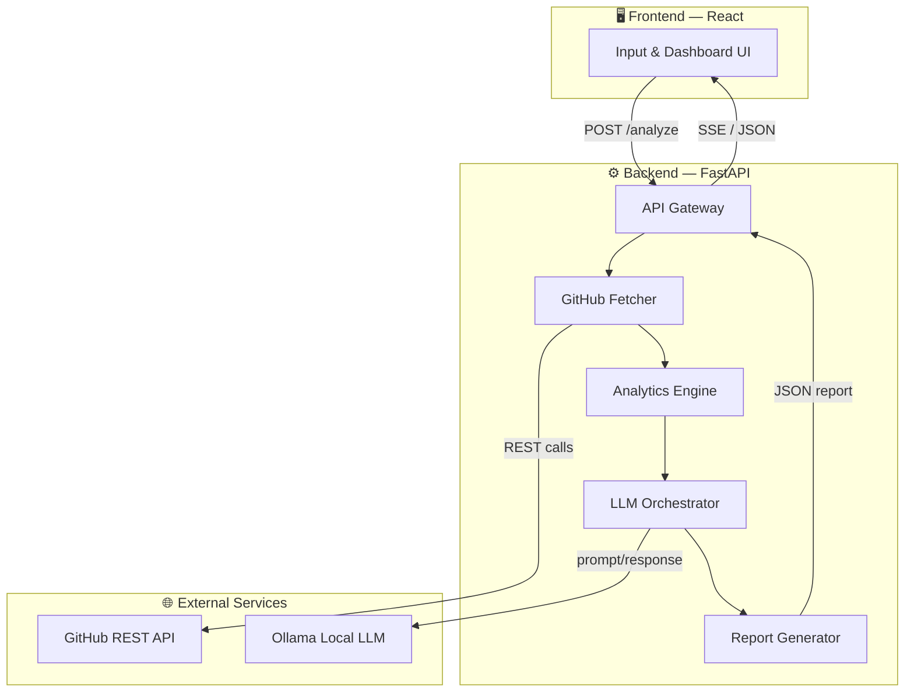
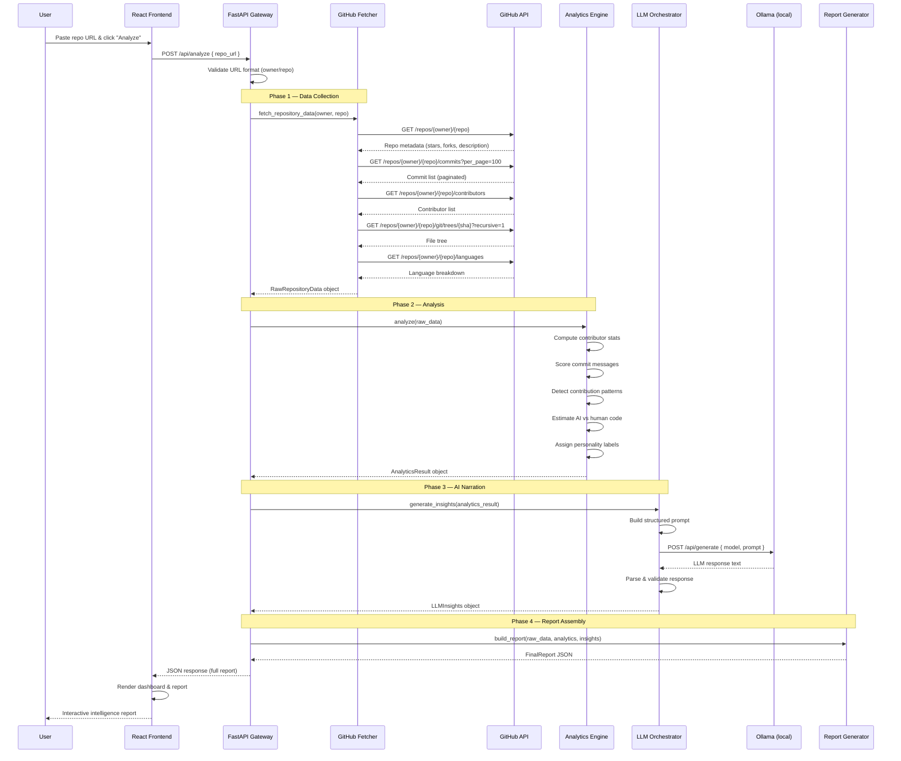

# AI-Powered GitHub Repository Intelligence Analyzer

> **Goal**: Build a full-stack application that takes a public GitHub repository URL, fetches its data, analyzes contributor behavior and code quality using heuristics + a local LLM (Ollama), and generates a beautiful, beginner-friendly intelligence report.

---

## 1. System Architecture

The system is divided into **5 core modules** plus a **cross-cutting utilities layer**.



### Module Breakdown

| # | Module | Responsibility |
|---|--------|----------------|
| 1 | **API Gateway** (`api/`) | Receives the repo URL from the frontend, validates input, orchestrates the pipeline, and returns the final report. Exposes SSE (Server-Sent Events) for real-time progress updates. |
| 2 | **GitHub Fetcher** (`fetcher/`) | Interacts with the GitHub REST API (unauthenticated or with an optional token). Fetches commits, contributors, file tree, languages, and repo metadata. Handles pagination and rate-limiting. |
| 3 | **Analytics Engine** (`analytics/`) | Pure Python analysis. Computes contributor stats, commit message quality scores, contribution patterns (time-of-day, day-of-week), coding consistency heuristics, and AI-vs-human code estimations. |
| 4 | **LLM Orchestrator** (`llm/`) | Constructs prompts from the analytics output, sends them to Ollama, parses and validates the LLM responses. Handles retries and fallback if Ollama is unavailable. |
| 5 | **Report Generator** (`report/`) | Assembles the final structured JSON report combining raw analytics, LLM narratives, contributor profiles, and summary sections. |
| — | **Utilities** (`utils/`) | Shared helpers: logging, config management, error handling, caching, and data models (Pydantic schemas). |

---

## 2. Data Flow

A step-by-step pipeline from user input to rendered report:



### Pipeline Summary (Plain English)

1. **Input** → User pastes a GitHub URL like `https://github.com/owner/repo`
2. **Validation** → Backend extracts `owner` and `repo`, checks format
3. **Fetch** → GitHub Fetcher makes 4-6 API calls to collect commits, contributors, file tree, languages, and metadata
4. **Analyze** → Analytics Engine crunches numbers:
   - How many commits per contributor? How frequently?
   - Are commit messages descriptive or lazy ("fix", "update")?
   - Do contributors work at consistent times, or in erratic bursts?
   - Heuristic: does the code look auto-generated? (file patterns, commit patterns)
5. **Narrate** → LLM Orchestrator sends a structured prompt to Ollama asking it to explain the project, describe team dynamics, and make recommendations
6. **Assemble** → Report Generator combines everything into a structured JSON
7. **Render** → React frontend displays the report as a beautiful dashboard

---

## 3. Project Structure

```
Code-Analyzer/
│
├── backend/                          # FastAPI application
│   ├── app/
│   │   ├── __init__.py
│   │   ├── main.py                   # FastAPI app entry point, CORS, lifespan
│   │   │
│   │   ├── api/                      # API layer
│   │   │   ├── __init__.py
│   │   │   ├── routes.py             # POST /analyze, GET /health, GET /status/{id}
│   │   │   └── schemas.py            # Request/Response Pydantic models
│   │   │
│   │   ├── fetcher/                  # GitHub data collection
│   │   │   ├── __init__.py
│   │   │   ├── github_client.py      # HTTP client for GitHub API (httpx)
│   │   │   ├── data_collector.py     # Orchestrates all fetch calls
│   │   │   └── models.py             # Raw data models (CommitData, ContributorData, etc.)
│   │   │
│   │   ├── analytics/                # Analysis engine
│   │   │   ├── __init__.py
│   │   │   ├── contributor_analyzer.py   # Per-contributor stats & scoring
│   │   │   ├── commit_analyzer.py        # Commit message quality scoring
│   │   │   ├── pattern_detector.py       # Time patterns, consistency analysis
│   │   │   ├── ai_code_estimator.py      # Heuristic AI-vs-human detection
│   │   │   ├── personality_labeler.py    # Assigns personality labels
│   │   │   └── models.py                # Analytics result models
│   │   │
│   │   ├── llm/                      # Ollama integration
│   │   │   ├── __init__.py
│   │   │   ├── ollama_client.py      # HTTP client for Ollama API
│   │   │   ├── prompt_builder.py     # Constructs analysis prompts
│   │   │   ├── response_parser.py    # Parses and validates LLM output
│   │   │   └── models.py             # LLM insight models
│   │   │
│   │   ├── report/                   # Report assembly
│   │   │   ├── __init__.py
│   │   │   ├── report_builder.py     # Combines all data into final report
│   │   │   └── models.py             # Final report schema
│   │   │
│   │   └── utils/                    # Shared utilities
│   │       ├── __init__.py
│   │       ├── config.py             # Settings via pydantic-settings (env vars)
│   │       ├── logger.py             # Structured logging setup
│   │       ├── cache.py              # Simple in-memory / file-based cache
│   │       └── exceptions.py         # Custom exception classes
│   │
│   ├── requirements.txt              # Python dependencies
│   ├── .env.example                  # Environment variable template
│   └── README.md                     # Backend setup instructions
│
├── frontend/                         # React application (Vite)
│   ├── public/
│   │   └── favicon.svg
│   ├── src/
│   │   ├── main.jsx                  # React entry point
│   │   ├── App.jsx                   # Root component with routing
│   │   ├── index.css                 # Global styles & design tokens
│   │   │
│   │   ├── components/               # Reusable UI components
│   │   │   ├── Header.jsx            # App header / navbar
│   │   │   ├── RepoInput.jsx         # URL input form with validation
│   │   │   ├── LoadingState.jsx      # Animated loading with progress steps
│   │   │   ├── ErrorDisplay.jsx      # Error messages with retry
│   │   │   └── Footer.jsx            # App footer
│   │   │
│   │   ├── pages/                    # Page-level components
│   │   │   ├── HomePage.jsx          # Landing page with input
│   │   │   └── ReportPage.jsx        # Full report dashboard
│   │   │
│   │   ├── sections/                 # Report sections (used in ReportPage)
│   │   │   ├── OverviewSection.jsx       # Repo summary & AI explanation
│   │   │   ├── ContributorSection.jsx    # Contributor cards with stats
│   │   │   ├── ContributorCard.jsx       # Individual contributor detail
│   │   │   ├── InsightsSection.jsx       # AI-generated insights & risks
│   │   │   ├── PatternsSection.jsx       # Contribution pattern charts
│   │   │   └── RecommendationsSection.jsx # LLM recommendations
│   │   │
│   │   ├── hooks/                    # Custom React hooks
│   │   │   └── useAnalyze.js         # API call hook with loading/error state
│   │   │
│   │   ├── services/                 # API communication
│   │   │   └── api.js                # Axios/fetch wrapper for backend calls
│   │   │
│   │   └── utils/                    # Frontend utilities
│   │       ├── constants.js          # API URLs, labels, colors
│   │       └── formatters.js         # Date/number formatting helpers
│   │
│   ├── package.json
│   ├── vite.config.js
│   └── README.md                     # Frontend setup instructions
│
├── .gitignore
└── README.md                         # Project-level README with full setup guide
```

---

## 4. Development Roadmap

### Phase 1 — MVP Core (Week 1-2)

> **Goal**: End-to-end pipeline working with basic UI

| Task | Details |
|------|---------|
| Backend setup | FastAPI project, CORS, health check endpoint |
| GitHub Fetcher | Fetch repo metadata, commits (last 100), contributors, file tree |
| Basic Analytics | Commit count per contributor, simple commit message scoring |
| API endpoint | `POST /api/analyze` returns raw analytics as JSON |
| Frontend setup | Vite + React project, input form, display raw JSON response |
| Integration test | Full flow: URL → fetch → analyze → display |

**Deliverable**: Paste a URL → see contributor stats and commit quality scores in the browser.

---

### Phase 2 — LLM Integration & Rich Analytics (Week 3-4)

> **Goal**: Ollama-powered insights + deeper analysis

| Task | Details |
|------|---------|
| Ollama client | Connect to local Ollama instance, handle streaming responses |
| Prompt engineering | Design prompts that produce structured, useful insights |
| Pattern detection | Time-of-day/day-of-week analysis, burst vs steady patterns |
| AI code estimation | Heuristics: repetitive commits, boilerplate file names, auto-gen patterns |
| Personality labeler | Map contributor stats to labels ("Workhorse", "Night Owl", etc.) |
| Report builder | Assemble all data into a structured `FinalReport` JSON |
| Frontend report UI | Beautiful dashboard with sections for each analysis component |

**Deliverable**: Full intelligence report with AI-generated narratives and contributor personality profiles.

---

### Phase 3 — Polish & UX (Week 5)

> **Goal**: Production-quality experience

| Task | Details |
|------|---------|
| Loading experience | SSE progress updates ("Fetching commits...", "Analyzing patterns...") |
| Error handling | Graceful handling of: invalid URLs, private repos, rate limits, Ollama down |
| Caching | Cache GitHub API responses to avoid redundant fetches |
| Responsive design | Mobile-friendly report layout |
| Animations | Micro-animations on contributor cards, section reveals, chart transitions |
| Dark mode | Premium dark theme as default |

**Deliverable**: A polished, delightful user experience.

---

### Phase 4 — Advanced Features (Week 6+, Optional)

> **Goal**: Extend capabilities

| Task | Details |
|------|---------|
| Pull Request analysis | Fetch PRs, review patterns, merge times |
| Comparison mode | Analyze 2 repos side-by-side |
| Export | Download report as PDF |
| History | Store past analyses (SQLite) and let users revisit them |
| GitHub token support | Optional token input for higher rate limits & private repos |
| Charts | Interactive charts using a lightweight library (Chart.js or Recharts) |

---

## 5. Challenges & Solutions

### Challenge 1: GitHub API Rate Limiting

> **Problem**: Unauthenticated requests are limited to **60 per hour**. A single analysis uses 4-6 requests. Rapid usage will hit the limit fast.

**Solutions**:
- **Optional GitHub token**: Allow users to provide a Personal Access Token (PAT) to get **5,000 req/hour**. Store only in-memory, never persist.
- **Response caching**: Cache fetched data by `owner/repo` with a TTL (e.g., 15 minutes). Repeated analyses of the same repo cost zero API calls.
- **Rate limit headers**: Read `X-RateLimit-Remaining` from GitHub responses and warn the user proactively before they hit the wall.

---

### Challenge 2: Ollama Availability & Speed

> **Problem**: Ollama must be running locally. It can be slow on machines without a GPU. The user might not have it installed at all.

**Solutions**:
- **Graceful degradation**: If Ollama is unreachable, return the report *without* LLM sections. Show a banner: "Install Ollama for AI-powered insights."
- **Health check**: `GET /api/health` checks Ollama connectivity and reports status to the frontend.
- **Model recommendation**: Default to a small, fast model like `llama3.2:3b` or `mistral:7b` — good quality, runs on most hardware.
- **Timeout handling**: Set a 60-second timeout for LLM calls with a fallback message.

---

### Challenge 3: Commit Message Quality Scoring

> **Problem**: "Good" vs "bad" commit messages is subjective. Simple keyword matching is unreliable.

**Solutions**:
- **Multi-factor scoring** (all heuristic, no AI needed):
  - **Length score**: Messages < 10 chars → low; 20-72 chars → ideal; > 200 chars → verbose penalty
  - **Specificity score**: Penalize vague words ("fix", "update", "stuff", "changes"); reward technical terms
  - **Format score**: Follows conventional commits (`feat:`, `fix:`, `docs:`) → bonus
  - **Uniqueness score**: Many identical messages ("update") → penalize
- Combine into a 0-100 quality score per contributor. This is a heuristic — no AI needed, and it's fast.

---

### Challenge 4: AI vs Human Code Detection

> **Problem**: There's no reliable way to tell if code was AI-generated. This is inherently speculative.

**Solutions**:
- **Be transparent**: Label this as "estimated" and "heuristic-based", never as definitive.
- **Heuristic signals** (suggestive, not conclusive):
  - Very large commits with many files changed at once
  - Boilerplate-heavy file names (e.g., auto-generated configs)
  - Extremely uniform commit timing (exactly every N minutes)
  - Commit messages that look templated or overly formal
  - Code-to-comment ratios that are unusually high
- **LLM opinion**: Ask the LLM to give its assessment based on the patterns, clearly marked as speculative.
- Display with a disclaimer: *"This is a heuristic estimate, not a definitive classification."*

---

### Challenge 5: Large Repositories

> **Problem**: Repos with thousands of commits and hundreds of contributors will be slow to fetch and analyze.

**Solutions**:
- **Pagination limits**: Fetch only the last 500 commits (configurable). This captures recent activity, which is most relevant.
- **Streaming progress**: Use SSE to send real-time status updates to the frontend ("Fetching page 3 of 5...").
- **Async processing**: Run the entire pipeline in a background task. The frontend polls or listens via SSE for completion.

---

### Challenge 6: Prompt Engineering for Consistent LLM Output

> **Problem**: LLMs produce variable-format responses. Parsing free-form text is fragile.

**Solutions**:
- **Structured prompting**: Ask the LLM to respond in a specific JSON or markdown format with clear section headers.
- **Response validation**: Parse the LLM response against an expected schema. If it fails, retry once with a simpler prompt.
- **Fallback templates**: If the LLM produces unusable output after retries, use template-based summaries generated from the raw analytics.
- **Few-shot examples**: Include 1-2 example outputs in the prompt to guide the model.

---

## Key Technology Choices

| Concern | Choice | Rationale |
|---------|--------|-----------|
| HTTP client (backend) | `httpx` | Async support, modern API, great for GitHub + Ollama calls |
| Data validation | `pydantic` | FastAPI-native, enforces schemas, great DX |
| Frontend bundler | Vite | Fast dev server, simple config, modern defaults |
| Frontend HTTP | `fetch` (native) | Zero dependencies, sufficient for our needs |
| Charts (Phase 4) | Recharts | React-native, declarative, lightweight |
| LLM model | `llama3.2:3b` or `mistral:7b` | Good quality, runs on CPU, free |
| Caching | In-memory dict + TTL | Simple, no external dependencies for MVP |

---

## User Review Required

> [!IMPORTANT]
> **LLM Model Selection**: The plan defaults to `llama3.2:3b` for speed. If you prefer higher quality and have a GPU, we can target `llama3.1:8b` or `mistral:7b` instead. Which do you prefer, or should we make it configurable?

> [!IMPORTANT]
> **GitHub Token**: The plan makes token input optional. Should we build a token input in the UI from Phase 1, or add it later?

> [!IMPORTANT]
> **Scope Confirmation**: Phase 1 excludes Pull Request analysis and charts. Are you comfortable starting without those, or do you want any of the Phase 4 features pulled into earlier phases?

## Open Questions

1. Do you have Ollama already installed? If so, which models do you have pulled?
2. Do you want the frontend to be a single-page app (no routing) or have separate Home/Report pages?
3. Any preference for color scheme or visual style for the dashboard?
4. Should the analysis results be persisted (database) from Phase 1, or is in-memory fine for MVP?
